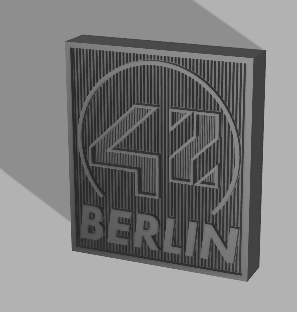

# 42 Berlin Logo 3D Printing Files

This repository contains the 3D model files for the 42 Berlin Logo, designed to be printed in multiple parts with a dual-color scheme (black and white). The design consists of 4 separate pieces, each requiring different prints for black and white sections. The model is also designed to accommodate LEDs for enhanced visual effects. This README provides instructions for the file structure and printing process.

## File Structure

### Main Files
- `42_logo_full_model_final.f3z`: Fusion 360 project file for the full model.
- `42_logo_full_model_final.stl`: Complete STL of the assembled logo.
- `42_logo_full_model_final_picture.png`: Rendered image of the model.

### Individual Parts
Each part is divided into a complete file, a black section, and a white section:

1. **Top-Right Part**
   - `42_logo_1_tr_final.stl`: Complete part.
   - `42_logo_1_tr_final_black.stl`: Black section.
   - `42_logo_1_tr_final_white.stl`: White section.

2. **Bottom-Right Part**
   - `42_logo_2_br_final.stl`: Complete part.
   - `42_logo_2_br_final_black.stl`: Black section.
   - `42_logo_2_br_final_white.stl`: White section.

3. **Bottom-Left Part**
   - `42_logo_3_bl_final.stl`: Complete part.
   - `42_logo_3_bl_final_black.stl`: Black section.
   - `42_logo_3_bl_final_white.stl`: White section.

4. **Top-Left Part**
   - `42_logo_4_tl_final.stl`: Complete part.
   - `42_logo_4_tl_final_black.stl`: Black section.
   - `42_logo_4_tl_final_white.stl`: White section.

## Printing Instructions

### General Guidelines
1. Use the `.stl` files for slicing in your preferred 3D printing software (e.g., Cura).
2. For best results, ensure your printer is calibrated for dual-color printing or plan to assemble the black and white sections manually after printing.

### Steps
1. **Prepare Files**: Load the corresponding black and white `.stl` files for each part.
2. **Color Matching**: Use black filament for the `_black` files and white filament for the `_white` files.
3. **Assembly**: Once all parts are printed, assemble the sections together to form the full logo. Use the complete `.stl` files as a reference for proper alignment.

## Notes
- The complete model (`42_logo_full_model_final.stl`) can be used for preview purposes but is not intended for direct printing due to its complexity.
- Ensure sufficient adhesion on your print bed for optimal results.
- If any issues arise during slicing or printing, refer to the Fusion 360 file (`42_logo_full_model_final.f3z`) for further customization or adjustments.

## Preview
Below is a rendered image of the full model for reference:

---

Feel free to open an issue or contribute to this repository if you have suggestions or improvements!

